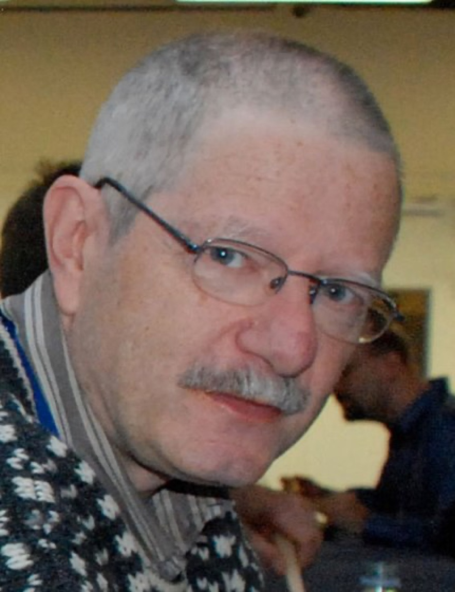
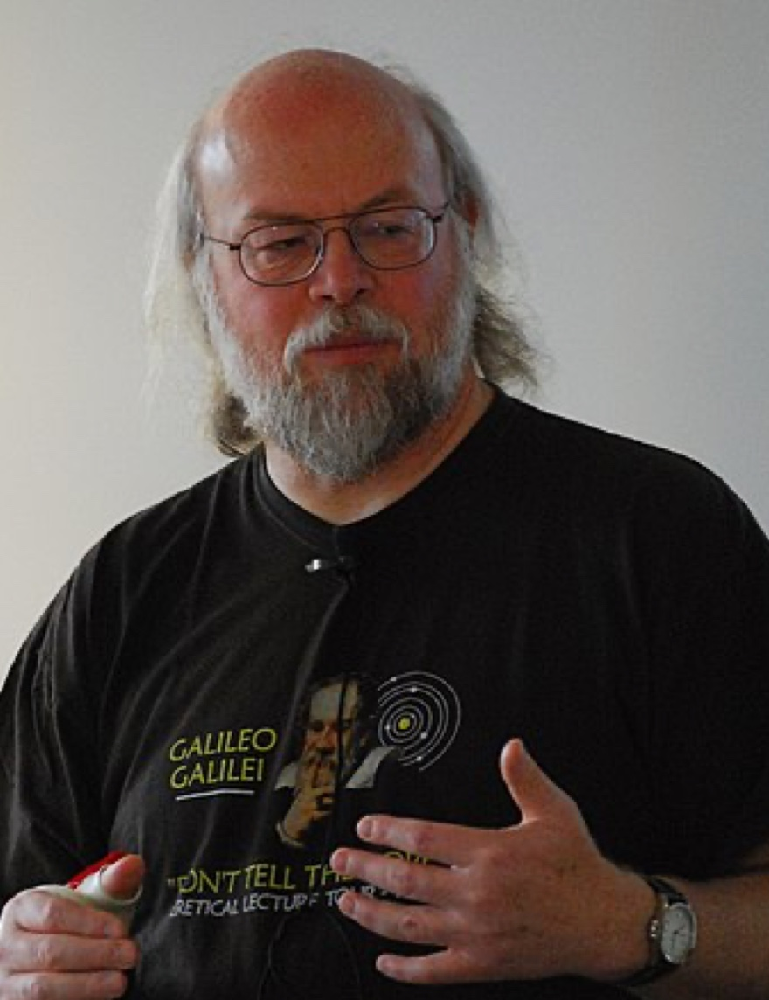

Programming Language Timeline
===

History of programming languages

## `1972` [C](https://www.open-std.org/jtc1/sc22/wg14/)

C is a general-purpose programming language. It was created in the 1970s by Dennis Ritchie and remains very widely used and influential.

## `1983` [Objective-C](https://developer.apple.com/library/archive/documentation/Cocoa/Conceptual/ProgrammingWithObjectiveC/Introduction/Introduction.html)

Brad Cox and Tom Love created Objective-C as the main language used for writing Apple software

## `1987` [Perl](https://www.perl.org)

[Perl](https://www.perl.org/) was developed by Larry Wall in 1987 as a general-purpose Unix scripting language to make report processing easier.

## `1986` [Erlang](https://www.erlang.org/)

[Erlang](https://www.erlang.org/) is a general-purpose, concurrent, functional high-level programming language, and a garbage-collected runtime system.

## `1983` [C++](https://isocpp.org/)

Bjarne Stroustrup created C++, which is an extension of the C programming language. This is one of the most used languages in the world

## `1991` [Python](https://www.ruby-lang.org/en/)

Guido Van Rossum developed [Python](https://www.python.org/), which is a simplified computer language that is easy to read

## `1991` [Visual Basic](https://learn.microsoft.com/en-us/previous-versions/visualstudio/visual-basic-6/visual-basic-6.0-documentation)

Microsoft developed Visual Basic, which enabled programmers to select and change specific chunks of code with a drag-and-drop process

## `1995` [JAVA](http://java.com/)

Sun Microsystems developed Java, originally intended to be used with hand-held devices

## `1995` PHP

Rasmus Lerdorf developed PHP, mainly for Web development. PHP continues to be widely used in Web development today

## `1995` [Ruby](https://www.ruby-lang.org/en/)

Yukihiro Matsumoto developed [Ruby](https://www.ruby-lang.org/en/) as an all-purpose programming language, ideal for many programming jobs. Ruby is widely used in the development of Web applications

## `1995` JavaScript

Brendan Eich developed JavaScript to enhance Web browser interactions

## `2000` C#

Microsoft developed C# as a combination of C++ and Visual Basic. C# is similar to Java in some ways

## `2003` [Scala](http://www.scala-lang.org/)

Martin Odersky created Scala as a programing language that combines aspects of functional programming

## `2009` [GO](https://go.dev/)

Google developed Go to solve issues that commonly occur with large software systems

## `2012` [TypeScript](https://www.typescriptlang.org/)

[TypeScript](https://www.typescriptlang.org/) is a free and open-source high-level programming language developed by Microsoft that adds static typing with optional type annotations to JavaScript.

## `2014` [Swift](https://www.swift.org/)

Apple developed Swift to replace C, C++, and Objective-C

## `2015` [Rust](https://www.rust-lang.org/)

Rust is a multi-paradigm, general-purpose programming language that emphasizes performance, type safety, and concurrency. 